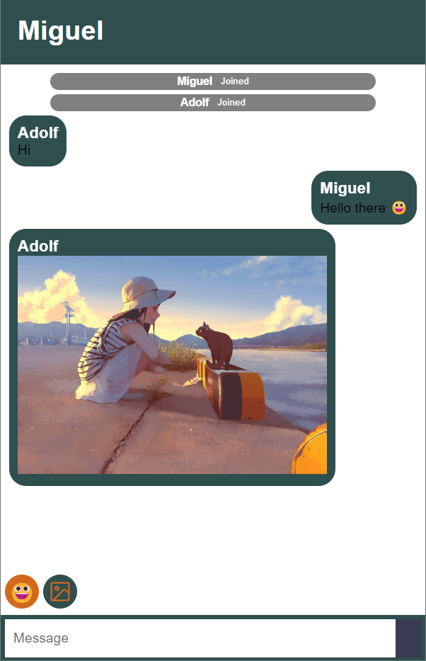

# WebsocketChat

Simple websocket chat developed using Python, JavaScript and HTML CSS

Support Emojis and Images

## Modules

Flask and FlaskSocketIO as Back-End

Solid-JS as Front_End

## Tutorial

1. Clone Project
2. Run ``npm run build`` in UI directory
3. Copy HTML file from ``/UI/dist/index.html`` ro ``/templates/`` 
4. Copy assets folder from ``/UI/dist/assets`` ro ``/static``
5. Run ``app.py``

## Screenshot

